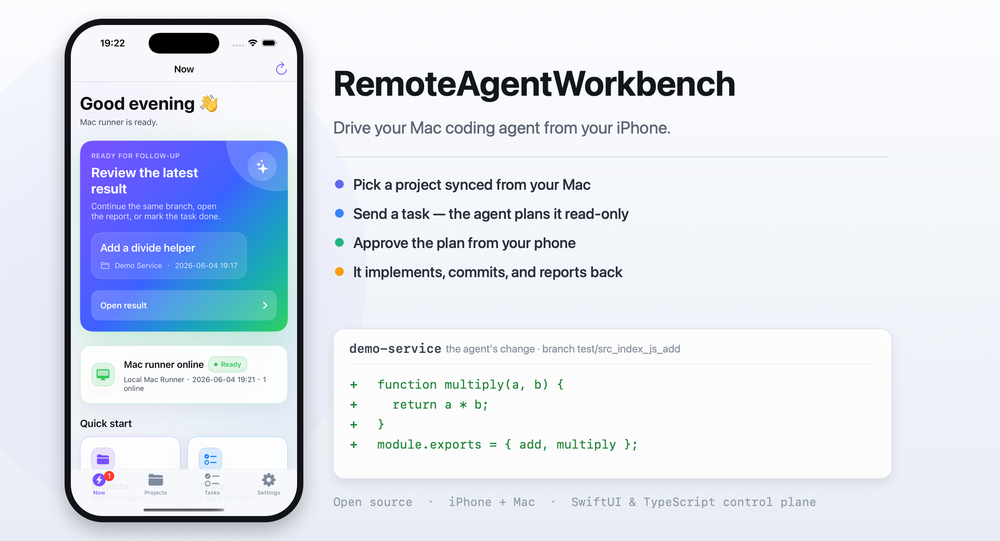
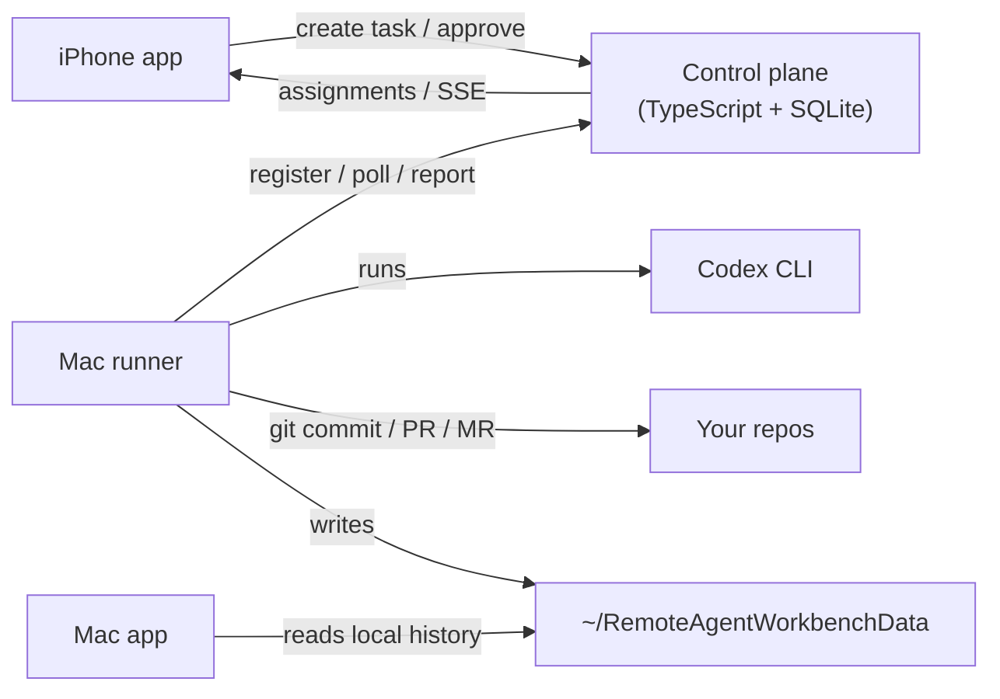

# RemoteAgentWorkbench

**English** · [简体中文](./README.zh-CN.md)



Drive a Mac-resident coding agent (the [Codex CLI](https://github.com/openai/codex)) from your iPhone: pick a project, send a task, review the plan, approve it, and let the agent implement, commit, and report back — all from your phone.

RemoteAgentWorkbench is a small, self-hostable control plane plus a native iOS/macOS client. It is intentionally minimal and built to be extended with more workflows.

## How it works



- **`server/`** — a minimal TypeScript control plane: project index, task metadata, approvals, lightweight events, and SSE. It never stores full transcripts.
- **`runner/`** — a daemon on your Mac that does the real work: runs the Codex CLI, drives Git, keeps full local history, and (optionally) publishes Markdown reports to a GitHub repo.
- **`ios-app/`** — the SwiftUI iPhone client for project-level orchestration (start, observe, approve, continue). The same project also builds a companion macOS app that reads local task history and `~/.codex/sessions` directly.
- **`deploy/`** — templates for VPS, Caddy, systemd, and launchd.

## Core workflow

The default path is "projects first + local history + lightweight phone status + GitHub reports":

1. Maintain a fixed project list on the Mac in `~/RemoteAgentWorkbenchData/projects.json`.
2. The runner syncs that list to the server on startup; the iPhone home screen shows your projects.
3. Start a task from a project page — no need to retype `repo` / `baseBranch` each time.
4. Mark a few high-frequency projects as `isFeatured` to pin them on the phone.
5. Create a folder from a directory preset on the phone; the runner creates it and adds it to Projects automatically.
6. The runner locks a real repo or a plain folder. With Git it follows a Git flow; without Git it works directly in the folder.
7. The review flow runs a read-only planning turn first; after you approve the plan on the phone it moves to the implementation turn.
8. The runner writes full local history to `~/RemoteAgentWorkbenchData/tasks/<taskId>/`.
9. Direct Submit goes straight from plan to implementation; a Git repo completes after a successful local commit, a plain folder completes once changes are saved.
10. After each plan, implementation, or Git action, the runner updates `report.md` and can push it to a separate GitHub reports repo.
11. The phone only syncs recent lightweight events; the full history stays on the Mac. The Mac app reads the local task directories and `~/.codex/sessions` for the complete picture.

## Features

- iPhone project list, project detail, in-project task creation, approvals, and report links
- Runner registration, heartbeat, and offline detection
- Lightweight SQLite persistence (project index, task metadata, approvals, recent events, report URLs)
- Completed tasks keep ~30 days of lightweight metadata, then auto-clean
- Three workspace sources: local repo path, plain local folder, or remote Git URL
- Task-level workspace locking
- Two delivery modes per `coding_session`:
  - `review_required` — commit / PR / MR go through approval
  - `direct_commit` / Direct Submit — a Git repo can commit locally after checks pass; a plain folder just needs its changes saved
- Codex CLI `new thread` and `resume thread`
- `commit / rebase / push / create PR / MR` approval flow (PR vs. MR chosen automatically from the repo `origin`)
- Full local history per task: `task.json`, `events.jsonl`, `artifacts/`, `report.md`, `session.json`
- Companion macOS app with local Projects and Local History windows
- Automatic GitHub report publishing with `reportURL` back-fill
- Real-time task detail over SSE, fetched per project rather than globally polled

## Requirements

- macOS with **Xcode 16+** and the iOS Simulator
- **[XcodeGen](https://github.com/yonaskolb/XcodeGen)** (`brew install xcodegen`) to generate the Xcode project
- **Node.js 20+** for the server and runner
- The **[Codex CLI](https://github.com/openai/codex)**, installed and authenticated on the Mac — the runner shells out to it for real coding turns
- Optional: **`gh`** (logged in) for GitHub PRs; **`GITLAB_TOKEN`** for GitLab MRs

## Quick start

### 1. Server

```bash
cd server
npm install
cp .env.example .env
npm run dev          # http://127.0.0.1:8787
```

Recommended extra env vars: `DATA_ROOT`, `DATABASE_PATH`, `TASK_RETENTION_DAYS=30`.

### 2. Runner

```bash
cd runner
npm install
cp .env.example .env
npm run dev
```

Runtime data lives under `~/RemoteAgentWorkbenchData/` (`repos`, `tasks`, `projects.json`, `report-publisher`). Point the `RUNNER_*` env vars elsewhere to relocate it.

To create review requests from the phone:

- **GitHub** — run `gh auth login` on the Mac runner
- **GitLab** — set `GITLAB_TOKEN` in the runner env (and `GITLAB_BASE_URL` for self-hosted GitLab)

The phone never stores a GitHub/GitLab token and the server never sees one — review requests are created only on the Mac runner.

### 3. iOS app

```bash
cd ios-app
xcodegen generate
open RemoteAgentWorkbench.xcodeproj
```

The app defaults to `http://127.0.0.1:8787`; change it under **Settings** to point at your own control plane.

> **Security:** `.env` files are gitignored — never commit real secrets. Set `RUNNER_SHARED_SECRET` to a long random value when exposing the server beyond localhost (leave it blank on both server and runner to disable runner auth for local dev).

## Delivery modes

- **`review_required`** — best for projects that ship via PR/MR. The agent finishes the change and checks, then waits for your approval.
- **`direct_commit` / Direct Submit** — best for "just get it done" tasks. A Git repo commits locally at the end of the implementation turn; a plain folder completes once files are saved. If a Git repo's turn ends without a commit, the task stays in `awaiting_human_input`.

## Verifying a change

```bash
cd server && npm test && npm run build
cd runner && npm test && npm run build
cd ios-app && xcodegen generate && xcodebuild -project RemoteAgentWorkbench.xcodeproj \
  -scheme RemoteAgentWorkbench -destination 'generic/platform=iOS Simulator' build
```

## Current limitations

- `Open in Codex App` opens the workspace; it does not inject the thread into the desktop app.
- The phone (v1) cannot fully edit the project list (use "Create Folder"); `projects.json` on the Mac is the source of truth.
- The phone (v1) has no "delete task" button; disk is bounded by server metadata + auto-clean.
- The server does not store full transcripts, Codex JSONL, or raw stdout/stderr.
- Automatic GitHub report push requires a separately configured reports repo.

## Extending it

The boundaries are designed for adding more workflows:

1. Add task command/result types in `server/src/domain/models.ts`
2. Add state-machine branches in `server/src/services/taskService.ts`
3. Add an assignment handler in `runner/src/index.ts`
4. Add the matching form and detail actions in the iOS app

## Contributing

Contributions are welcome — see [CONTRIBUTING.md](./CONTRIBUTING.md) for local setup, tests, and conventions.

## Documentation

- [Cookbook (Chinese)](./docs/COOKBOOK.zh-CN.md)
- [Configuration (Chinese)](./CONFIGURATION.zh-CN.md)
- [Real deployment setup (Chinese)](./deploy/REAL_SETUP.zh-CN.md)

## License

[MIT](./LICENSE) © 2026 Fernando
