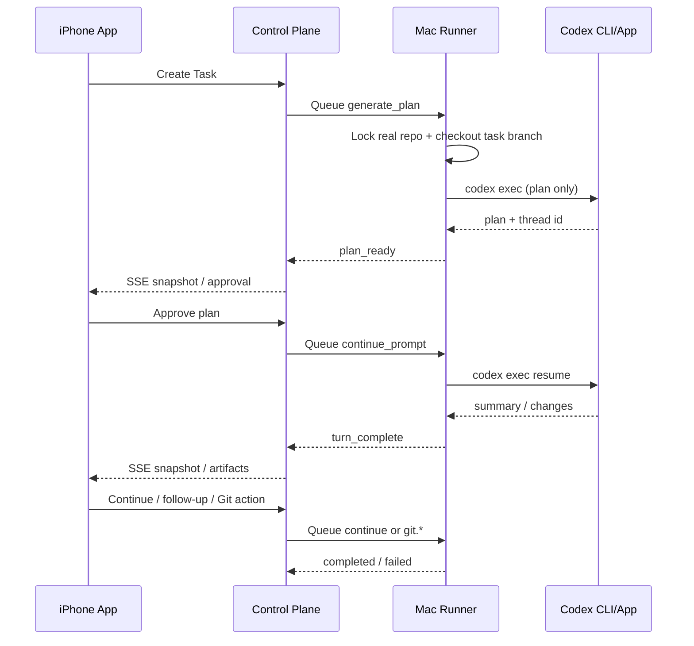

# RemoteAgentWorkbench Cookbook

这份文档不是产品宣讲，而是给你自己和后续协作者用的“操作手册 + 开发手册 + 排障手册”。

目标很明确：

- 用 iPhone 发起任务
- 让指定 Mac Runner 准备仓库和 Codex 线程
- 先出 plan，再做人工审批
- 再进入实现、继续追问、Git 审批、push、PR，或者按项目配置直接本地 commit
- 需要时随时切回桌面接管
- 未来继续接第二条、第三条 workflow，而不是把第一条写死

## 1. 心智模型

这套架构刻意采用了成熟 agent workflow 常见的几个原则：

- Control plane 要窄：`server/` 只负责任务状态、审批、Runner 路由、SSE。
- 执行器要本地化：`runner/` 只负责这台 Mac 上的真实项目 repo / 普通文件夹、任务记录、Codex、Git、未来的更多工具。
- UI 只做 orchestration：`ios-app/` 只负责发起、观察、审批、继续，不直接执行高权限动作。
- 任务记录与真实仓库隔离：`tasks/` 只存历史和产物，实际执行与 Git 操作直接发生在项目真实 repo。
- 高风险 Git 默认必须审批：`review_required` 模式下，`commit`、`rebase`、`push`、`create PR` 都走显式审批流。
- `direct_commit` / Direct Submit 是“直接干完”：Git repo 允许实现 turn 末尾本地 commit；普通文件夹不要求 Git，保存完变更和检查总结后即可完成。
- 线程要可恢复：首轮可以 `new_thread`，也可以 `resume_thread`，让手机和桌面共享同一个 Codex 上下文。

## 2. 系统组成

### `server/`

- Fastify 控制面
- 保存任务、审批、artifact、event、runner 信息
- 对 iPhone 暴露 REST + SSE
- 对 Runner 暴露 claim / heartbeat / complete 接口

### `runner/`

- 常驻在 Mac 上
- 负责 repo cache、真实 repo 执行、Codex CLI、Git 命令
- 轮询 server 拉取 assignment
- 心跳上报在线状态

### `ios-app/`

- SwiftUI
- 网络层使用 `Moya + CombineMoya`
- 状态管理使用 `ObservableObject + @Published`
- 任务详情通过 SSE 持续订阅更新

## 3. 当前已实现的第一条 Workflow



## 4. 快速启动

### 4.1 依赖

至少需要这些本机依赖：

- Node.js 20+
- `npm`
- `git`
- `codex` CLI，且已经在这台 Mac 上登录可用
- `gh`，如果你要用 `create_pr`
- `xcodegen`
- Xcode，如果要编译 iOS app

### 4.2 启动 Server

```bash
cd ~/Code/RemoteAgentWorkbench/server
npm install
cp .env.example .env
npm run dev
```

关键配置：

- `HOST=0.0.0.0`
- `PORT=8787`
- `PUBLIC_BASE_URL=http://你的可访问地址:8787`
- `RUNNER_SHARED_SECRET=一个你自己生成的值`
- `CORS_ORIGINS=*`：开发期方便，公网部署时建议收紧

### 4.3 启动 Runner

```bash
cd ~/Code/RemoteAgentWorkbench/runner
npm install
cp .env.example .env
npm run dev
```

关键配置：

- `SERVER_BASE_URL=http://你的 server 地址:8787`
- `RUNNER_SHARED_SECRET=和 server 保持一致`
- `RUNNER_ID=runner-local-mac`
- `RUNNER_NAME=Local Mac Runner`
- `RUNNER_LABELS=local,mac,codex`
- `RUNNER_CAPABILITIES=codex_app_server,codex_cli,git_guard,xcodebuild`

可移植性最关键的是下面四项：

- `RUNNER_DATA_ROOT`
- `RUNNER_REPO_CACHE_DIR`
- `RUNNER_WORKSPACE_DIR`
- `RUNNER_CODEX_HOME`

如果你希望换新电脑时尽量无痛迁移，推荐把这些目录统一挂到一个你自己管理的位置，例如：

```dotenv
RUNNER_DATA_ROOT=/Users/yourname/RemoteAgentWorkbenchData
RUNNER_REPO_CACHE_DIR=/Users/yourname/RemoteAgentWorkbenchData/repos
RUNNER_WORKSPACE_DIR=/Users/yourname/RemoteAgentWorkbenchData/worktrees
RUNNER_CODEX_HOME=/Users/yourname/RemoteAgentWorkbenchData/codex-home
```

### 4.4 启动 iOS App

```bash
cd ~/Code/RemoteAgentWorkbench/ios-app
xcodegen generate
open RemoteAgentWorkbench.xcodeproj
```

首次运行后在 `Settings` 里设置：

- iOS Simulator 调同机 server：`http://127.0.0.1:8787`
- 真机调同局域网 server：`http://你的 Mac 局域网 IP:8787`
- 真机调公网 server：`https://你的域名`

## 5. 日常操作 Cookbook

### 5.1 Recipe A: 发起一个全新的编码任务

适用场景：

- 这是一个新需求
- 不想复用旧线程上下文
- 希望先让 Codex 看仓库并给一版 plan

手机端填写建议：

- `Title`：一句话描述任务目标
- `Repository`：本地路径或远程 Git URL
- `Base Branch`：例如 `main`
- `Mode`：`New Thread`
- `Prompt`：把约束写清楚，尤其是“不要直接 commit / push”

推荐 prompt 模板：

```text
实现这个需求，先审阅仓库和需求，按最小改动原则完成。
完成后运行最相关的检查并汇总结果。
Git 收尾请遵守当前任务选择的 delivery mode。
```

推荐工作流选择：

- `review_required`：适合需要提 MR / PR 的项目，保持现在的审批流。
- `direct_commit` / Direct Submit：适合只要求本地改动和检查通过的项目。Git repo 允许实现 turn 直接本地 commit；普通文件夹不要求 Git，保存完变更后也会进入 `completed`。如果 Git repo 的 turn 结束时还没 commit，则继续停在 `awaiting_human_input`。

Runner 实际会做的事：

1. 解析 `repo`
2. 如果是本地路径，优先找到 git root；找不到也按普通文件夹继续执行
3. 如果是远程 URL，clone 或 fetch 到 repo cache
4. 基于 `baseBranch` 在真实 repo 创建或切到任务分支 `codex/<taskId>`
5. 先执行只读 planning turn
6. 把 plan 和 thread id 回传给 server

你会看到的核心状态：

- `queued`
- `preparing_workspace`
- `awaiting_plan_approval`
- 审批通过后再次回到 `queued`
- 实现时进入 `running`
- `review_required` 实现完成后变成 `awaiting_human_input`
- `direct_commit` 在 Git repo 成功本地 commit 后会直接进入 `completed`；普通文件夹保存完变更后也会进入 `completed`；如果 Git repo 的实现 turn 没 commit，仍是 `awaiting_human_input`

### 5.2 Recipe B: 从历史线程继续

适用场景：

- 你之前已经在 Codex CLI 或 Codex 里跑过这件事
- 你希望手机继续复用同一条 thread
- 你想保留完整上下文，不想重新解释一遍

操作方式：

- `Mode` 选 `Resume History`
- 填 `Thread ID`

当前行为要点：

- Runner 首轮依然会先出一版 plan
- 但 plan 是基于历史 thread materialize 出来的
- 审批通过后，会继续对同一条 thread 做 `codex exec resume`

适合的任务：

- 长线重构
- 断点恢复
- 需要桌面和手机来回切换的任务

### 5.3 Recipe C: 审批 plan 再进入实现

这是第一条 workflow 的关键安全闸门。

plan 出来后，server 会创建一个 `plan.execute` 审批。你在手机端看到 plan 以后，有三种常见选择：

- 直接批准：进入实现
- 不批准，然后发 follow-up：让它先调整方案
- 不批准，转桌面接管：直接在本机 Codex App 里继续

最佳实践：

- 需求含糊时，先让它补 plan，不要急着进入 full-auto 实现
- 涉及大改动、迁移、生成代码时，先看它是否明确列出验证步骤
- 如果 plan 没提到检查项，最好先要求补上测试/验证策略

### 5.4 Recipe D: 发 follow-up 继续改

实现 turn 结束后，通常会进入 `awaiting_human_input`。

`direct_commit` 例外：

- 如果这一轮已经成功本地 `commit`，任务会直接进入 `completed`
- 如果这一轮还没 `commit`，任务仍会停在 `awaiting_human_input`

这时你有两条路：

- 点 `Continue`
- 在 `Follow-up` 文本框里补充新要求后 `Send`

两者区别：

- `Continue`：发的是默认续写指令，适合“按当前上下文继续”
- `Send`：发的是你的明确新指令，适合“补改、回滚某部分、增加测试、换实现方案”

推荐 follow-up 示例：

```text
不要动业务逻辑，只把这次改动拆成更小的提交前形态。
补上最相关的单元测试，并说明覆盖了哪些分支。
把 UI 文案改成更接近 Apple HIG 的表达。
先不要 push，先给我一版 diff 摘要和风险点。
```

### 5.5 Recipe E: Git 审批流

当前支持四个 Git 动作：

- `commit`
- `rebase`
- `push`
- `create PR`

这些动作都不会立刻执行，而是先创建审批。

### 推荐顺序

最稳妥的顺序通常是：

1. 实现完成，检查 summary
2. `Commit`
3. `Rebase`
4. `Push`
5. `Create PR`

### Commit

你可以先填提交信息，再点 `Commit`。

Runner 实际会：

- `git add -A`
- 检查是否真的有 staged 变更
- `git commit -m "<message>"`

如果没有变更，会直接失败并回到任务错误态。

当前完成语义：

- `review_required`：`Commit` 只是生成本地提交，任务仍可继续，通常还要后续 `Push` / `Create PR`
- `direct_commit`：`Commit` 成功后，任务会直接进入 `completed`

### Rebase

Runner 会把当前任务分支 rebase 到 `baseBranch`。

注意：

- 当前版本没有专门的冲突 UI
- 如果 rebase 冲突，Runner 会把任务标记为 `failed`
- 更适合你切桌面接管，或者后续补“冲突处理 workflow”

### Push

Runner 会执行当前分支：

```bash
git push -u origin codex/<taskId>
```

当前行为：

- `push` 成功后，任务会进入 `completed`

### Create PR

Runner 会调用本机 `gh pr create --draft`。

前提：

- 本机安装了 `gh`
- 已经 `gh auth login`
- 仓库远端是 GitHub

当前行为：

- 创建 draft PR 成功后，任务会进入 `completed`

### 5.6 Recipe F: 切回桌面接管

在任务详情点 `Open in Codex` 以后，Runner 会执行：

```bash
codex app <workspacePath>
```

当前能力边界：

- 会打开对应任务的工作目录
- 如果 server 里已经记录了 thread id，summary 里会带出来
- 但还不会把 thread 自动注入到桌面 App 的 UI 上下文里

所以这个动作的定位更准确地说是：

- “打开正确的工作区”
- 不是“100% 无缝恢复到桌面线程界面”

### 5.7 Recipe G: 本地路径仓库 vs 远程 URL

### 本地路径

示例：

```text
~/code/my-repo
/Users/yourname/code/my-repo
```

特点：

- 最适合“手机控制这台 Mac 干活”
- Runner 会先把路径展开，再找到 git root
- 不需要重新 clone

### 远程 URL

示例：

```text
git@github.com:your-org/your-repo.git
https://github.com/your-org/your-repo.git
```

特点：

- Runner 会 clone/fetch 到 repo cache
- 更适合做共享、固定、可迁移的 runner 环境

## 6. 面向 iPhone App 的 API Cookbook

如果你后面自己手搓 iPhone app，下面这些接口就是最小可用集合。

### 6.1 创建任务

```bash
curl -X POST http://127.0.0.1:8787/v1/tasks \
  -H 'Content-Type: application/json' \
  -d '{
    "workflowKey": "coding_session",
    "deliveryMode": "review_required",
    "title": "Polish onboarding flow",
    "prompt": "Polish the onboarding flow, run relevant checks, and follow the selected Git workflow.",
    "repo": "~/code/my-app",
    "baseBranch": "main",
    "executionMode": "new_thread"
  }'
```

从历史线程继续：

```bash
curl -X POST http://127.0.0.1:8787/v1/tasks \
  -H 'Content-Type: application/json' \
  -d '{
    "workflowKey": "coding_session",
    "deliveryMode": "direct_commit",
    "title": "Continue the refactor",
    "prompt": "Continue from the existing thread, run relevant checks, and follow the selected Git workflow.",
    "repo": "~/code/my-app",
    "baseBranch": "main",
    "executionMode": "resume_thread",
    "resumeThreadId": "thread_123"
  }'
```

`deliveryMode` 目前有两个值：

- `review_required`：保持当前流程，Codex 不会在实现 turn 里直接 commit。
- `direct_commit` / Direct Submit：Codex 在 Git repo 完成改动并通过相关检查后，可以直接本地 `git add -A` + `git commit`；普通文件夹不要求 Git，保存完变更即可完成。成功本地 commit 或普通文件夹完成都会进入 `completed`，但仍不自动 `push` / `create_pr`。

### 6.2 查看任务和实时事件

```bash
curl http://127.0.0.1:8787/v1/tasks
curl http://127.0.0.1:8787/v1/tasks/<taskId>
curl -N http://127.0.0.1:8787/v1/tasks/<taskId>/events
```

SSE 里当前会发两种事件：

- `task.snapshot`
- `heartbeat`

### 6.3 发 follow-up

```bash
curl -X POST http://127.0.0.1:8787/v1/tasks/<taskId>/messages \
  -H 'Content-Type: application/json' \
  -d '{
    "message": "Add tests for the edge cases before we move to git actions."
  }'
```

默认继续：

```bash
curl -X POST http://127.0.0.1:8787/v1/tasks/<taskId>/actions/continue
```

桌面接管：

```bash
curl -X POST http://127.0.0.1:8787/v1/tasks/<taskId>/actions/open-in-codex-app
```

### 6.4 请求 Git 动作

提交：

```bash
curl -X POST http://127.0.0.1:8787/v1/tasks/<taskId>/git/commit \
  -H 'Content-Type: application/json' \
  -d '{
    "message": "feat: polish onboarding flow"
  }'
```

rebase：

```bash
curl -X POST http://127.0.0.1:8787/v1/tasks/<taskId>/git/rebase \
  -H 'Content-Type: application/json' \
  -d '{}'
```

push：

```bash
curl -X POST http://127.0.0.1:8787/v1/tasks/<taskId>/git/push \
  -H 'Content-Type: application/json' \
  -d '{}'
```

创建 PR：

```bash
curl -X POST http://127.0.0.1:8787/v1/tasks/<taskId>/git/create-pr \
  -H 'Content-Type: application/json' \
  -d '{}'
```

### 6.5 处理审批

列出审批：

```bash
curl http://127.0.0.1:8787/v1/approvals
```

批准：

```bash
curl -X POST http://127.0.0.1:8787/v1/approvals/<approvalId>/decision \
  -H 'Content-Type: application/json' \
  -d '{
    "decision": "approve"
  }'
```

拒绝：

```bash
curl -X POST http://127.0.0.1:8787/v1/approvals/<approvalId>/decision \
  -H 'Content-Type: application/json' \
  -d '{
    "decision": "deny"
  }'
```

### 6.6 Runner 接口

这些接口是 Runner 专用，iPhone app 不应该直接调：

- `POST /v1/runner/hello`
- `POST /v1/runner/:runnerId/heartbeat`
- `POST /v1/runner/:runnerId/claim`
- `POST /v1/runner/:runnerId/tasks/:taskId/log`
- `POST /v1/runner/:runnerId/tasks/:taskId/complete`

它们受 `x-runner-secret` 保护。

## 7. 迁移到新 Mac 的操作手册

目标是做到“代码目录换机器了，但 workflow 不需要从零重搭”。

### 7.1 最少需要迁移什么

至少保留这些东西：

- `~/Code/RemoteAgentWorkbench`
- 你自定义的 `RUNNER_DATA_ROOT`
- `runner/.env`
- `server/.env`
- `RUNNER_CODEX_HOME` 指向的数据目录

通常不一定能直接复制的东西：

- `codex` 登录态，是否可迁移取决于你的本地配置方式
- `gh` 登录态
- SSH key / Git credential helper
- Xcode / Command Line Tools

### 7.2 推荐迁移步骤

1. 在新 Mac 安装 `git`、Node、`codex`、`gh`、Xcode、`xcodegen`
2. 拷贝 `RemoteAgentWorkbench/`
3. 拷贝 `RUNNER_DATA_ROOT`
4. 校验 `runner/.env` 里的目录路径在新机器上仍然存在
5. 重新登录 `codex`
6. 如需 PR，重新 `gh auth login`
7. 启动 server 和 runner
8. 用 iPhone 的 `Settings` 切到新 server 地址

### 7.3 哪些状态现在不会迁移

当前 server 是内存态，所以：

- server 重启后，任务列表会丢
- 审批记录会丢
- artifact 和 event 会丢

但如果你保住了：

- repo cache
- worktree 目录
- Codex thread id

你仍然可以用 `Resume History` 重新挂回主要执行上下文。

## 8. 扩展第二条、第三条 Workflow 的架构约定

后面你一定会接更多 flow，所以不要把第一条 workflow 的假设散落进全局。

推荐约定如下：

### 8.1 server 只负责状态机，不直接执行工具

新增 workflow 时，server 里只做：

- 新的 command kind
- 新的审批类型
- 新的 artifact 类型
- 新的状态流转

不要在 server 里直接调用 Git、SSH、Xcode 或脚本。

### 8.2 runner 做工具适配层

新增 workflow 时，Runner 应该像现在的 coding session 一样，只负责：

- 取 command
- 准备本地上下文
- 调具体工具
- 把 summary / artifact / completion 回写给 server

这样未来很容易接这些流：

- PR review flow
- deploy flow
- hotfix flow
- benchmark flow
- test triage flow
- design-to-code flow

### 8.3 iOS 只暴露 orchestration，不暴露底层复杂性

手机端页面最好继续保持三类动作：

- 发起
- 审批
- 继续

不要把“Runner 内部的每一步脚本参数”都暴露到手机 UI。

### 8.4 统一 command 设计

一个新 workflow 至少想清楚四件事：

1. 它的最小 command 集合是什么
2. 哪些动作需要审批
3. 结束后要沉淀什么 artifact
4. 它失败后是 `awaiting_human_input`、`failed`，还是未来要引入更细的状态

### 8.5 建议下一条最值得接的 workflow

如果以实用性排序，推荐优先做：

1. `pr_review`：给一个 PR 或 branch，跑 review，总结风险点，再由手机决定是否继续修
2. `deploy`：从手机批准部署，但 Runner 只负责本地或远端部署命令的安全执行
3. `conflict_resolution`：专门处理 rebase / merge 冲突

## 9. 运维建议

### 9.1 开发期部署方式

开发期最简单：

- Server 前台跑 `npm run dev`
- Runner 前台跑 `npm run dev`
- iPhone 用 Simulator 或真机直连

### 9.2 稳定运行方式

如果你想把它变成常驻服务，建议后续补：

- `launchd` 启动项，让 server 和 runner 开机自启
- 反向代理和 HTTPS，例如 Caddy
- server 持久化存储
- 真正的设备鉴权，而不是现在的占位 pairing

### 9.3 现在的安全边界

当前版本只适合：

- 你自己的环境
- 内网测试
- 受控公网环境

原因：

- iPhone app 还没有正式用户鉴权
- pairing 接口目前是 demo 级占位
- server 主要靠 `RUNNER_SHARED_SECRET` 保护 Runner 通道

## 10. 故障排查

### 10.1 手机里看不到 Runner

检查：

- Runner 是否真的启动
- `SERVER_BASE_URL` 是否正确
- `RUNNER_SHARED_SECRET` 是否与 server 一致
- server 是否监听在正确地址
- iPhone 的 `Server URL` 是否可达

手动验证：

```bash
curl http://127.0.0.1:8787/v1/runners
```

### 10.2 任务一直卡在 `queued`

通常说明：

- 没有在线 Runner
- Runner 正在忙
- Runner claim 失败

检查：

- Runner 日志里是否持续 heartbeat 成功
- `currentTaskId` 是否一直没释放
- server 里是否有积压审批或未完成 command

### 10.3 plan 出不来

检查：

- `codex` CLI 是否已安装
- 当前 shell 能否直接执行 `codex exec --help`
- `RUNNER_CODEX_HOME` 是否有权限问题
- 仓库路径是否存在

### 10.4 `Open in Codex` 失败

检查：

- 本机能否执行 `codex app <path>`
- 图形会话里是否允许拉起 App
- worktree 路径是否仍存在

### 10.5 `create PR` 失败

检查：

- 是否安装 `gh`
- 是否已 `gh auth login`
- 当前仓库远端是不是 GitHub
- 当前分支是否已经 push

### 10.6 rebase 失败

当前版本最现实的处理方式：

1. 从手机先看失败摘要
2. 点 `Open in Codex`
3. 在桌面里处理冲突
4. 回到手机继续后续流程

### 10.7 iOS 构建失败

当前项目依赖 `Moya + CombineMoya`。如果 SwiftPM 缓存异常，优先尝试：

```bash
cd ~/Code/RemoteAgentWorkbench/ios-app
xcodegen generate
xcodebuild -project RemoteAgentWorkbench.xcodeproj -scheme RemoteAgentWorkbench -destination 'generic/platform=iOS Simulator' -clonedSourcePackagesDirPath /tmp/RemoteAgentWorkbenchSourcePackages build
```

如果还失败，再检查：

- `~/Library/Caches/org.swift.swiftpm/repositories`
- `/tmp/RemoteAgentWorkbenchSourcePackages`

## 11. 建议你接下来优先做的三件事

1. 给 server 加持久化存储，把任务/审批/event/artifact 落盘。
2. 给 server 和 iPhone 补正式鉴权，把现在的 pairing 升级成真实设备配对。
3. 给 Runner 补 `launchd` 模板和一键安装脚本，把“可移植”真正做到一键落地。
# 注意

> 这份文档包含历史环境示例，其中可能出现作者本机路径、旧域名或一次性的调试命令。当前仓库的正式配置入口请以 `CONFIGURATION.zh-CN.md` 和 `deploy/*.example` 模板为准。
